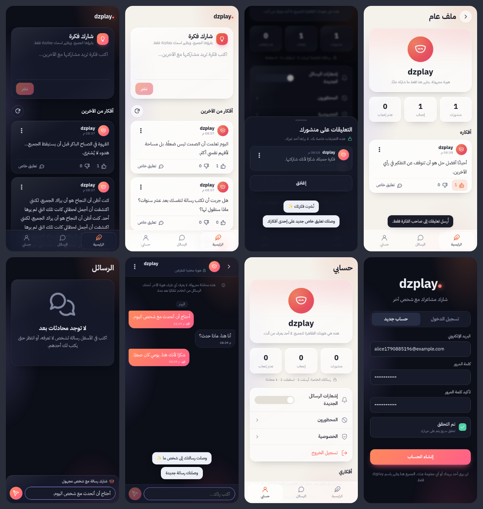

# DZPLAY — شارك مشاعرك مع شخص آخر

منصة بمسارين، وكل المستخدمين فيها يظهرون باسم واحد فقط: **dzplay**.

| المسار | الفكرة |
|---|---|
| **الأفكار العامة** (الرئيسية) | تنشر فكرة نصية ← يقرؤها الجميع ← إعجاب / عدم إعجاب ← التعليقات **خاصة بصاحب المنشور فقط**. |
| **الرسائل المجهولة** (الرسائل) | تكتب رسالة ← يختار الخادم شخصًا عشوائيًا ← يرد ← محادثة خاصة مجهولة. |

لا صور، لا متابعين، لا مكالمات، لا معلومات شخصية.

> نسخة تجريبية (MVP) تعمل فعليًا، ومختبرة آليًا (87 اختبارًا + اختبار Redis) وعبر متصفح حقيقي بمستخدمَين.



---

## 1. المعمارية باختصار

```
 المتصفح (PWA, RTL, Mobile-first)                 الخادم (FastAPI — خادم واحد)
 ┌───────────────────────────────┐   HTTPS/JSON   ┌──────────────────────────────────────┐
 │ واجهة JS بدون build            │ ─────────────▶ │ /api  (auth, messages, sync, admin)  │
 │ نسخة محلية من المحادثات        │                │ WebSocket /api/ws  (إشارات "تغيّر")  │
 │ صندوق صادر offline (outbox)    │ ◀───────────── │ مهمة تنظيف TTL دورية                  │
 │ Service Worker + Web Push      │   WebSocket    └───────┬───────────────────┬──────────┘
 └───────────────────────────────┘                         │                   │
                                                   PostgreSQL (أو SQLite)   Redis (اختياري)
                                                   الحسابات + الرسائل المؤقتة   rate limits + pub/sub
```

**القرارات التقنية ولماذا:**

| القرار | السبب |
|---|---|
| **Python + FastAPI** | سريع التطوير، واضح، نفس لغة مشروعك الحالي (بوت تيليجرام)، أداء ممتاز لـ MVP. |
| **PostgreSQL** في الإنتاج / **SQLite** للتطوير | البيانات علائقية بطبيعتها (مستخدم ↔ محادثة ↔ رسالة ↔ حظر)، والاختيار العشوائي بقيود يحتاج استعلامات JOIN/EXISTS. TTL مطبّق بعمود `expires_at` مفهرس + مهمة تنظيف. نفس الكود يعمل على الاثنين (SQLAlchemy). |
| **Redis اختياري** | غير ضروري لخادم واحد (حدود المعدل في الذاكرة). عند تشغيل أكثر من worker/خادم: `REDIS_URL` يجعل حدود المعدل والإشعارات اللحظية مشتركة. |
| **واجهة Vanilla JS (PWA)** بدون أدوات بناء | لا npm build، لا تبعيات أمامية، سهلة الصيانة، تُثبَّت على الهاتف كتطبيق، تعمل offline. |
| **WebSocket يحمل "إشارات" فقط** | الخادم يرسل `{"type":"sync"}` ثم يطلب العميل `/api/sync`. نفس المسار يعالج التحديث اللحظي وإعادة الاتصال بعد الانقطاع ← لا تضارب في البيانات. |
| **لا Kubernetes ولا Microservices** | خادم واحد + قاعدة بيانات واحدة. الكود مقسّم (services / api / security) بحيث يمكن فصل الخدمات لاحقًا. |

### الأفكار العامة (Posts)
- **منفصلة تمامًا عن الرسائل**: جداول خاصة (`posts`, `post_reactions`, `comments`, `profile_refs`) و API خاص (`/api/posts`, `/api/profiles`).
- **ترتيب الـ Feed** يتم في الخادم: سحب عشوائي موزون (weighted random) لكل جلسة تصفح؛ العشوائية هي الأساس، والحداثة والتفاعل يرفعان الاحتمال قليلًا فقط مع سقف (`FEED_ENGAGEMENT_CAP`) حتى لا يحتكر المنشور المشهور القمة. كل إعدادات الخوارزمية في `.env` (`FEED_*`). الترقيم بـ cursor ثابت داخل الجلسة، والضغط على ↻ يعطي ترتيبًا جديدًا.
- **الإعجاب/عدم الإعجاب**: تفاعل واحد لكل مستخدم لكل منشور (قيد `UNIQUE` في قاعدة البيانات)، يمكن تبديله أو إزالته. العدادات `likes_count` و `dislikes_count` مخزنة في المنشور وتُحدَّث ذريًا، فالقراءة سريعة دون عدّ الجدول.
- **التعليقات خاصة**: لا يعيد أي API نص التعليقات أو عددها إلا لصاحب المنشور، والتحقق `current_user == post.owner` يتم في الخادم (`403` لغيره). من يكتب التعليق نفسه لا يراه بعد الإرسال.
- **الملف العام**: يظهر `dzplay` + عدد المنشورات والإعجابات وعدم الإعجاب + المنشورات فقط. الملف يُفتح بمرجع عام عشوائي (`ref`) وليس بالمعرّف الداخلي، و**لا يظهر هذا المرجع أبدًا في الرسائل المجهولة**، فلا يمكن ربط أفكار شخص بمحادثاته الخاصة.
- الحماية نفسها تنطبق: حدود المعدل (`MAX_POSTS_PER_*`, `MAX_COMMENTS_PER_*`, `MAX_REACTIONS_PER_MINUTE`)، منع التكرار، الإبلاغ عن المنشورات والتعليقات، الحظر (يمنع التعليق والرسائل معًا)، وإجراء الإدارة `remove` لإخفاء محتوى مخالف.

### فصل الهوية الحقيقية عن الهوية الظاهرة
- قاعدة البيانات فيها: معرّف داخلي دائم (UUID)، البريد، hash كلمة المرور (Argon2id) أو `sub` من Google، الطوابع الزمنية، وبيانات مكافحة الإساءة.
- كل ما يخرج للعميل يمر عبر دوال serialize في `app/services/messaging.py` فقط، والطرف الآخر دائمًا `"dzplay"`.
- معرّفات المحادثات والرسائل عشوائية 128-bit غير قابلة للتخمين؛ المعرّف الداخلي للمستخدم لا يُرسل أبدًا للعميل.
- عناوين IP لا تُخزَّن خامًا أبدًا: تُخزَّن كبصمة HMAC بمفتاح سري (الحظر يعمل، والعنوان الحقيقي غير موجود في القاعدة).

### تخزين الرسائل المؤقت (TTL)
| البيانات | المدة (قابلة للتعديل) |
|---|---|
| رسالة غير مقروءة | `MESSAGE_TTL` = 7 أيام كحد أقصى |
| رسالة بعد قراءتها | `MESSAGE_TTL_AFTER_READ` = يوم واحد (وقت كافٍ لمزامنة أجهزة المرسل) |
| محادثة بلا نشاط | `CONVERSATION_IDLE_TTL` = 14 يومًا ثم تُحذف مع رسائلها |
| أحداث الأمان | 30 يومًا |
| البلاغات المغلقة | 90 يومًا (البلاغات المفتوحة تبقى حتى المراجعة) |

حذف الرسائل من الخادم **لا يكسر المحادثة**: الجهاز يحتفظ بنسخته المحلية من سجل المحادثة طالما المحادثة موجودة، وتُمسح عند تسجيل الخروج. جداول المحادثات/الرسائل منفصلة منطقيًا عن جداول الحسابات (لا مفاتيح أجنبية من بيانات الهوية إليها) ويمكن نقلها لمخزن آخر لاحقًا.

---

## 2. هيكل المشروع

```
dzplay/
├── app/
│   ├── main.py            # إنشاء التطبيق، middleware الأمان، الملفات الثابتة، مهمة التنظيف
│   ├── config.py          # كل الإعدادات (env / .env)
│   ├── models.py          # مخطط قاعدة البيانات
│   ├── api/               # المسارات: auth, messages, admin, ws
│   ├── security/          # كلمات المرور، الجلسات، anti-bot (PoW)، IP
│   ├── services/          # منطق العمل: auth, matching, messaging, ideas, rate_limit, cleanup, realtime, push, admin
│   ├── migrations.py      # إضافة الأعمدة الجديدة تلقائيًا عند التحديث (بدون فقدان بيانات)
│   └── admin_cli.py       # أوامر الإدارة
├── static/                # الواجهة (PWA): index.html, css/, js/, sw.js, manifest, icons, fonts
├── tests/                 # 87 اختبارًا (pytest)
├── e2e/run_e2e.py         # اختبار متصفح حقيقي بمستخدمَين
├── e2e/run_admin_e2e.py   # اختبار متصفح للوحة التحكم
├── Dockerfile, docker-compose.yml, Caddyfile, Procfile
└── .env.example           # كل القيم القابلة للتعديل مع شرحها
```

---

## 3. التشغيل محليًا

المتطلبات: Python 3.11+

```bash
cd dzplay
python3 -m venv .venv
source .venv/bin/activate            # على ويندوز: .venv\Scripts\activate
pip install -r requirements.txt
cp .env.example .env                 # الإعدادات الافتراضية تعمل مباشرة (SQLite)
uvicorn app.main:app --reload --port 8000
```

افتح `http://localhost:8000` — للتجربة بمستخدمَين افتح نافذة عادية + نافذة خاصة (Incognito) وسجّل حسابين.

> ملاحظة: الرسالة تحتاج شخصًا آخر مسجلًا لتصله. إذا كنت المستخدم الوحيد ستظهر رسالة "لا يوجد أشخاص متاحون الآن".

---

## 4. الاختبارات

```bash
pip install -r requirements-dev.txt
pytest                                   # 87 اختبارًا على SQLite
```

على PostgreSQL + Redis (كما في الإنتاج):
```bash
DZ_TEST_DATABASE_URL=postgresql+psycopg://postgres@127.0.0.1:5432/dzplay_test \
DZ_TEST_REDIS_URL=redis://127.0.0.1:6379/0 pytest
```

اختبار متصفح حقيقي (يشغّل خادمًا ومستخدمَين ويحفظ لقطات شاشة):
```bash
playwright install chromium   # مرة واحدة
python e2e/run_e2e.py
python e2e/run_admin_e2e.py   # لوحة التحكم
```

ما تغطيه الاختبارات: التسجيل، الدخول، Google (بتوكن مُحاكى)، anti-bot وإعادة الاستخدام، حظر IP بعد 3 محاولات لمدة 4 ساعات، عدم معاقبة المستخدمين خلف نفس الـ IP، قفل الحساب، التباطؤ التدريجي، حد حسابين لكل IP، إرسال/استقبال/رد، الاختيار العشوائي وقواعده، عدم تسريب الهوية، الحظر، البلاغات، حدود السبام، TTL والتنظيف، المزامنة بعد الانقطاع، WebSocket، الإدارة، ورؤوس الأمان.

---

## 5. النشر

### الخيار A — خادم VPS (أمر واحد) ✅ موصى به
على خادم Ubuntu/Debian، انسخ هذا الأمر والصقه:
```bash
curl -fsSL https://raw.githubusercontent.com/mahdm723/Fffhff/claude/github-access-check-c1exvo/dzplay/deploy/install.sh | sudo bash
```
يثبّت Docker، ويولّد كل الأسرار، ويشغّل Caddy (HTTPS تلقائي) ← DZPLAY ← PostgreSQL + Redis، ثم يعطيك رابط التطبيق. لا تحتاج نطاقًا: يستخدم `<IP>.sslip.io` مجانًا، أو نطاقك عبر `DOMAIN=...`. إعادة تشغيل نفس الأمر = تحديث.
الدليل الكامل خطوة بخطوة (مع تثبيت التطبيق على الهاتف): [`deploy/README.md`](deploy/README.md)

### الخيار B — Railway / Render (مثل بوتك الحالي)
1. أنشئ خدمة من هذا المستودع واجعل **Root Directory = `dzplay`** (الـ `Procfile` جاهز).
2. أضف PostgreSQL (و Redis اختياريًا) من لوحة المنصة.
3. متغيرات البيئة:
   ```
   ENV=production
   SECRET_KEY=<قيمة عشوائية طويلة>
   DATABASE_URL=postgresql+psycopg://...   (غيّر بادئة postgres:// إلى postgresql+psycopg://)
   TRUST_PROXY_HEADERS=true
   TRUSTED_PROXY_COUNT=1
   ```
4. انشر. كل `git push` يعيد النشر تلقائيًا.

### تطبيق أندرويد (APK)
- `android/`: تطبيق أندرويد أصلي (Java، بدون مكتبات خارجية) يعرض DZPLAY داخل WebView خاص به بملء الشاشة. لا يعتمد على Chrome (يعمل على هواتف هواوي بدون خدمات Google وعلى الهواتف التي فيها نسختان من Chrome)، ويفتح صفحات موقعك فقط داخله؛ أي رابط آخر يُفتح في المتصفح. أيقونة متكيفة، شاشة بداية، زر رجوع يتنقل بين الشاشات، صفحة عدم اتصال، ومشاركة عبر قائمة المشاركة الأصلية.
- البناء يتم آليًا في GitHub Actions (`.github/workflows/android-apk.yml`) كـ APK **غير موقّع**، ثم يُوقَّع خارج CI بمفتاح خاص لا يُرفع أبدًا إلى المستودع العام.
- الخادم يقدّم `/.well-known/assetlinks.json` (الإعدادان `ANDROID_APP_PACKAGE` و `ANDROID_CERT_SHA256`) لتُفتح روابط الموقع داخل التطبيق، ويقدّم الملف على `/download/dzplay.apk`.
- لا حاجة لـ APK جديد عند تحديث الخادم؛ فقط عند تغيير النطاق (`appHost` في `android/gradle.properties`).
- إشعارات الرسائل عندما يكون التطبيق مغلقًا غير مدعومة بعد داخل تطبيق أندرويد (مدعومة في المتصفح). يمكن إضافتها لاحقًا بإشعارات أصلية.

### بعد النشر
- **Google Sign-In (اختياري):** أنشئ OAuth Client من نوع *Web* في Google Cloud Console، أضف نطاقك في *Authorized JavaScript origins*، وضع `GOOGLE_CLIENT_ID`. بدونه يختفي الزر ويعمل البريد + كلمة المرور فقط.
- **إشعارات Push (اختياري):** `python -m app.admin_cli gen-vapid` ثم ضع المفتاحين في البيئة.
- **الإدارة:** ضع `ADMIN_API_TOKEN`.

> مهم: HTTPS ضروري في الإنتاج (الكوكيز `Secure`، الإشعارات، والـ Service Worker).
> عدد الـ workers: واحد يكفي. لأكثر من worker أو أكثر من خادم يجب ضبط `REDIS_URL`.

---

## 6. الإعدادات

كل القيم في `.env.example` مع شرح كل واحدة: حدود الرسائل، محاولات الدخول، مدة حظر IP، عدد الحسابات لكل IP، مدد TTL، قواعد الاختيار العشوائي، طول الرسالة، سياسة الروابط… لا شيء من هذا مكتوب داخل الكود.

أهمها:
| المتغير | الافتراضي | المعنى |
|---|---|---|
| `LOGIN_MAX_ATTEMPTS` | 3 | محاولات خاطئة متتالية قبل الحظر |
| `IP_BLOCK_DURATION` | 14400 | مدة الحظر (4 ساعات) |
| `LOGIN_BLOCK_SCOPE` | `ip_account` | `ip_account`: يُحظر الـ IP على ذلك الحساب فقط (لا يُعاقب الأبرياء خلف NAT/شبكة الهاتف)، ويُحظر الـ IP كاملًا بعد `IP_MAX_FAILED_LOGINS` محاولة على حسابات مختلفة. `ip`: حظر الـ IP كاملًا بعد 3 محاولات (حرفيًا). |
| `MAX_ACCOUNTS_PER_IP` | 2 | حسابات جديدة لكل IP خلال `ACCOUNTS_PER_IP_WINDOW` (4 ساعات) |
| `MAX_MESSAGES_PER_MINUTE` / `_PER_HOUR` | 10 / 120 | حدود الإرسال |
| `MAX_NEW_CONVERSATIONS_PER_HOUR` / `_PER_DAY` | 5 / 20 | رسائل عشوائية جديدة |
| `MAX_CONSECUTIVE_MESSAGES` | 8 | رسائل متتالية قبل أن يرد الطرف الآخر |
| `MATCHING_RULES` | `no_open_conversation,not_recent_partner,inbound_capacity` | قواعد الاختيار الاختيارية |
| `MESSAGE_TTL` / `MESSAGE_TTL_AFTER_READ` | 7 أيام / يوم | مدة بقاء الرسائل |
| `MAX_MESSAGE_LENGTH` | 1000 | طول الرسالة |
| `MAX_POST_LENGTH` / `MAX_COMMENT_LENGTH` | 2000 / 500 | طول المنشور / التعليق |
| `MAX_POSTS_PER_HOUR` / `_PER_DAY` | 5 / 20 | حدود النشر |
| `FEED_*` | — | إعدادات خوارزمية ترتيب الأفكار (العشوائية، الحداثة، التفاعل، السقف) |

---

## 7. الـ API

كل المسارات تحت `/api`. الطلبات غير GET تتطلب الترويسة `X-DZ-Requested: 1` (حماية CSRF). الأخطاء بصيغة موحدة: `{"error": {"code", "message", "retry_after?"}}`.

| الطريقة | المسار | الوصف |
|---|---|---|
| GET | `/api/config` | إعدادات عامة للواجهة |
| POST | `/api/auth/challenge` | تحدي anti-bot (`purpose`: register/login) |
| POST | `/api/auth/register` | إنشاء حساب (email, password, password_confirm, antibot) |
| POST | `/api/auth/login` | دخول |
| GET | `/api/auth/google/nonce` | nonce لمرة واحدة لـ Google |
| POST | `/api/auth/google` | دخول/تسجيل بـ Google ID token |
| POST | `/api/auth/logout` | خروج (إلغاء الجلسة) |
| GET | `/api/me`، `/api/profile` | `dzplay` + الإحصائيات |
| POST | `/api/messages` | إرسال رسالة لشخص عشوائي (= `/messages/send`) |
| GET | `/api/conversations` | قائمة المحادثات |
| GET | `/api/conversations/{id}` | رسائل محادثة (`before`, `limit`) |
| POST | `/api/conversations/{id}/messages` | رد |
| POST | `/api/conversations/{id}/read` | تعليم كمقروء |
| POST | `/api/conversations/{id}/block` | حظر الطرف الآخر |
| POST | `/api/conversations/{id}/report` | الإبلاغ عن محادثة |
| POST | `/api/messages/{id}/report` | الإبلاغ عن رسالة |
| DELETE | `/api/conversations/{id}` | حذف المحادثة من قائمتي |
| GET | `/api/sync?since=` | مزامنة بعد الاتصال/الانقطاع |
| POST | `/api/posts` | نشر فكرة |
| GET | `/api/posts/feed?cursor=` | الـ Feed (ترتيب الخادم + ترقيم) |
| GET / DELETE | `/api/posts/{id}` | منشور (بدون تعليقات) / حذف منشوري |
| PUT | `/api/posts/{id}/reaction` | `{"reaction": "like" \| "dislike" \| null}` |
| POST | `/api/posts/{id}/comments` | تعليق خاص لصاحب المنشور |
| GET | `/api/posts/{id}/comments` | التعليقات — **لصاحب المنشور فقط** (403 لغيره) |
| POST | `/api/posts/{id}/report` | الإبلاغ عن منشور |
| POST / DELETE | `/api/comments/{id}/report`، `/api/comments/{id}/block`، `/api/comments/{id}` | إجراءات صاحب المنشور على التعليقات |
| GET | `/api/profiles/{ref}`، `/api/profiles/{ref}/posts` | الملف العام ومنشوراته |
| GET / DELETE | `/api/blocks`، `/api/blocks/{id}` | المحظورون / إلغاء الحظر |
| POST | `/api/push/subscribe`، `/api/push/unsubscribe` | إشعارات Push |
| WS | `/api/ws` | إشارات لحظية |
| GET/POST | `/api/admin/*` | الإدارة (تتطلب `ADMIN_API_TOKEN`) |
| GET | `/api/admin/activity?days=14&tz=-60` | أعداد يومية فقط للرسم البياني في لوحة التحكم |
| GET | `/admin` | لوحة التحكم (صفحة؛ تعمل فقط عند ضبط `ADMIN_API_TOKEN`) |

---

## 8. الأمان

- **كلمات المرور:** Argon2id، ولا تُخزن نصًا أبدًا. نفس زمن الاستجابة لبريد غير موجود (لا كشف للحسابات).
- **الجلسات:** توكن عشوائي 256-bit في كوكي `HttpOnly; Secure; SameSite=Strict`؛ القاعدة تحفظ SHA-256 فقط. تنتهي وتُلغى عند الخروج أو الحظر.
- **Anti-bot:** تحدي proof-of-work ذاتي الاستضافة (بدون أطراف ثالثة أو تتبع)، موقّع بـ HMAC، لمرة واحدة، مرتبط بالغرض والوقت، وتزداد صعوبته للـ IP المشبوه + حقل honeypot.
- **حماية الدخول:** تباطؤ تدريجي، حظر IP+حساب بعد 3 محاولات لـ 4 ساعات، حظر IP كامل عند تخمين حسابات متعددة، قفل الحساب ضد التخمين الموزع، حد إنشاء الحسابات لكل IP، قائمة IP موثوقة، وتسجيل كل الأحداث.
- **Google:** التحقق من التوقيع، `aud`، `iss`، الصلاحية، `email_verified`، و nonce لمرة واحدة. لا يُخزَّن access token. لا دمج تلقائي مع حساب بكلمة مرور بنفس البريد (لمنع الاستيلاء المسبق).
- **المحتوى:** نص فقط؛ تطبيع Unicode، إزالة محارف التحكم وعكس الاتجاه، رفض HTML والروابط، والعرض دائمًا عبر `textContent`.
- **الويب:** CSP صارم بدون inline scripts، `X-Frame-Options: DENY`، `nosniff`، `no-referrer`، HSTS، حماية CSRF، فحص Origin للـ WebSocket، حد لحجم الطلب، استعلامات SQL مُعلَّمة (ORM) فقط.
- **التفويض:** كل عملية تتحقق من الملكية على الخادم؛ محادثة ليست لك = 404 (لا فرق بين "غير موجودة" و"ليست لك").
- **IP خلف بروكسي:** فعّل `TRUST_PROXY_HEADERS` فقط خلف بروكسي موثوق، واضبط `TRUSTED_PROXY_COUNT`.

## 9. الخصوصية وسياسة الإدارة

- الإحصائيات الإدارية أرقام فقط بدون أي محتوى.
- تعليقات الأفكار لا يراها إلا صاحب المنشور. لا يطّلع عليها المشرف إلا إذا أبلغ صاحب المنشور عن تعليق بعينه.
- إحصائيات الرسائل الخاصة تظهر لصاحب الحساب فقط؛ الزوار يرون إحصائيات الأفكار العامة فقط.
- لا يطّلع المشرف على نص أي رسالة إلا عبر **البلاغات**: عند الإبلاغ تُنسخ الرسالة المُبلّغ عنها فقط (أو آخر 10 رسائل من الطرف المُبلّغ عنه عند الإبلاغ عن محادثة) لكي تبقى بعد انتهاء TTL.
- المستخدمون يُشار إليهم في الإدارة بمرجع داخلي، ولا تعرض واجهة الإدارة البريد.
- الإيقاف التلقائي: عند وصول بلاغات من `REPORT_AUTO_SUSPEND_THRESHOLD` أشخاص مختلفين خلال 24 ساعة يُوقف الحساب مؤقتًا عن الإرسال حتى المراجعة.

### لوحة التحكم (من الهاتف أو الكمبيوتر)
افتح `https://<رابط تطبيقك>/admin` وأدخل رمز المشرف (`ADMIN_API_TOKEN` من ملف `.env`). الصفحة غير مرتبطة من التطبيق ولا تُفهرس.

- **نظرة عامة:** أهم الأرقام، كل الإحصائيات، ورسم نشاط يومي (7 / 14 / 30 يومًا) للمستخدمين الجدد والأفكار والمحادثات ومحاولات الدخول الفاشلة، مع عرض كجدول. تتحدث كل 30 ثانية.
- **البلاغات:** الدليل المحفوظ، نوع المحتوى، عدد البلاغات ضد المستخدم، وإجراءات: تجاهل / تحذير / حذف المحتوى / إيقاف / حظر (مع تأكيد).
- **الأمان:** سجل الأحداث مع تصفية حسب النوع (مراجع مستخدمين وبصمات شبكة مختصرة فقط).
- **الصيانة:** تشغيل التنظيف الآن، وتغيير حالة حساب بمرجعه.

الحماية: الرمز يُحفظ في `sessionStorage` للنافذة فقط ويُرسل كـ `Authorization: Bearer`؛ بعد 10 رموز خاطئة من نفس الشبكة خلال 10 دقائق تُرفض الشبكة (429) قبل مقارنة الرمز، وتُسجَّل المحاولات كـ `admin_auth_failed`. نفس سياسة الخصوصية: لا بريد، ولا محتوى رسائل إلا دليل البلاغات.

### أوامر الإدارة
```bash
python -m app.admin_cli stats                     # المستخدمون، الرسائل، المحادثات، الحظر، المحاولات الفاشلة
python -m app.admin_cli reports                   # البلاغات المفتوحة مع الدليل
python -m app.admin_cli resolve <report_id> ban   # dismiss | warn | remove | suspend | ban
python -m app.admin_cli set-status <user_ref> active
python -m app.admin_cli events --type login_failed
python -m app.admin_cli cleanup                   # تشغيل التنظيف يدويًا
```
أو عبر HTTP: `curl -H "Authorization: Bearer $ADMIN_API_TOKEN" https://domain/api/admin/stats`

---

## 10. حدود هذا الإصدار والخطوات القادمة

- الجداول تُنشأ تلقائيًا عند التشغيل؛ عند تغيير المخطط مستقبلًا يُنصح بإضافة Alembic للترحيلات.
- لا يوجد تحقق من ملكية البريد بالإيميل (لا يرسل الخادم رسائل بريد). يمكن إضافته لاحقًا مع مزوّد بريد.
- الإشعارات عند إغلاق التطبيق تحتاج HTTPS + مفاتيح VAPID.
- للتوسع: `REDIS_URL` + عدة workers، ثم فصل خدمة الرسائل المؤقتة إن لزم.
